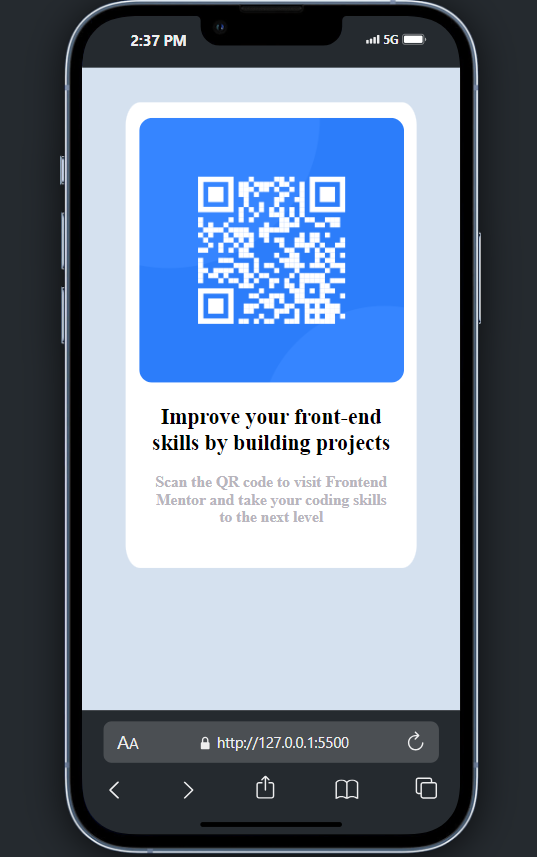
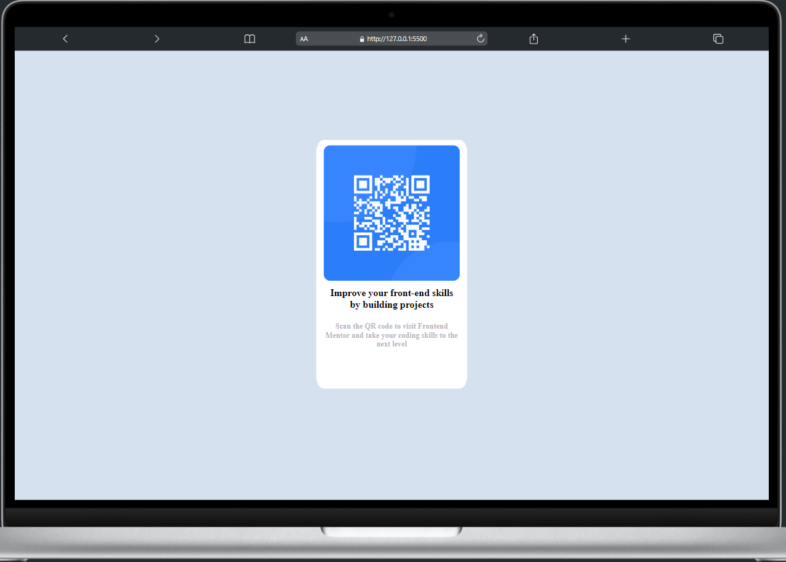

## SCREENSHOT

## lINK
- Solution URL: [http://127.0.0.1:5500/qr-code-component-main/index.html]
- Live Site URL: []

## Build with
- Media Quiere - mobile and desktop responsive

## Author 
- Website [Julio Salas] URL:[]
- Fronted Mentor [Julio Salas] URL:[https://www.frontendmentor.io/profile/WebDesign-MultiMedia]

## Acknowledgements
- To be succesful you need basic knowledge of HTML/CSS.